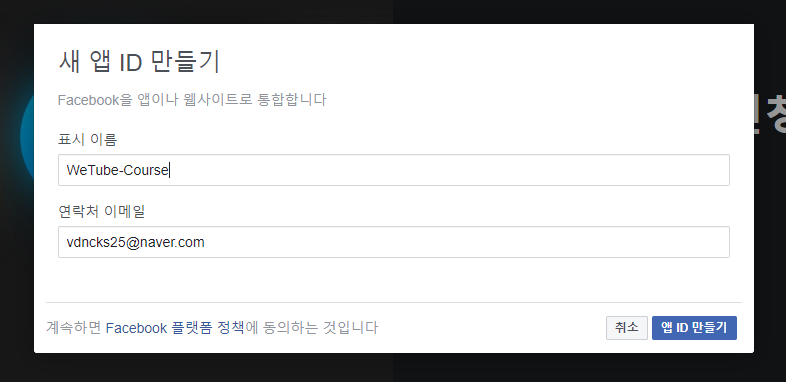

# Facebook Login 

<br>

## 1. 설정 

### 1. 페이스북 개발자 페이지로 이동 

> https://developers.facebook.com/

<br>

### 2. 내 앱 → 새 앱 추가

> 

<br>

### 3. Facebook 로그인 설정  

> #### 3-1. 대시보드 → Facebook 계정 로그인 설정 
> 
> 

> #### 3-2. Web → Site URL 설정 → save → 계속 
> 
> 

> 나머지 단계는 해당 프로젝트에서는 사용하지 않으므로 넘어간다. <완료>

<br>

### 4. 프로젝트 내 ID값 설정 

> 설정탭의 기본설정 
> 
> 
> 
> 각각의 ID를 프로젝트 내의 .env 파일에 기입 

<br>

### 5. passport, Router 설정 

> ```js
> // passport.js 
> ... 
> import FacebookStrategy from "passport-facebook";  
>
> ... 
> passport.use(
>    new FacebookStrategy({
>       clientID: process.env.FB_ID, 
>       clientSecret: process.env.FB_SECRET, 
>       callbackURL: `http://localhost:4000${routes.facebookCallback}`   
>   }, facebookLoginCallback)
> );
> ```
> ```js
> // routes.js
> ...
> const FB = "/auth/facebook";
> const FB_CALLBACK = "/auth/facebook/callback";
> 
> ... 
> const routes = {
>    ... 
>   facebook: FB, 
>   facebookCallback: FB_CALLBACK  
> }

<br>

### 6. callback을 위한 함수 생성 

> ```js
> // /controllers/userController.js
> ...
> // 페이스북 페이지로 보내는 것 
> export const facebookLogin = passport.authenticate('facebook'); 
>
> // user가 있는지 확인 ( 계정을 찾아내거나 혹은 새로 생성 )
> export const facebookLoginCallback = (accessToken, refreshToken, profile, cb) => {
>     console.log(accessToken, refreshToken, profile, cb)
> }; 
>
> // 인증 성공했을 때 redirect 해주는 것 
> export const postFacebookLogin = (req, res) => {
>     res.redirect(routes.home);
> }; 
> ```

<br>

### 7. globalRouter 설정 

> ```js
> // /routers/globalRouter.js
> ...
> // 사용자를 페이스북 웹사이트를 보낸다. 
> globalRouter.get(routes.facebook, facebookLogin); 
>
> // callback 처리 함수 (실패하면 home으로, 성공하면 postFacebookLogin 처리)
> globalRouter.get(
>     routes.facebookCallback, 
>     passport.authenticate('facebook', { failureRedirect: "/login " } ), 
>     postFacebookLogin
> );
> ```

<br>

### 8. 버튼에 링크 설정 

> ```js 
> // /views/partials/socialLogin.pug
> ... 
>     button.social-login--facebook
>        a(href=routes.facebook)
>            span
>                i.fab.fa-facebook
>            | Continue with Facebook
> ```

<br>

### 9. 개발상태  ON

> 8번 까지 진행한후 페이스북 로그인 버튼을 클릭하면 사용자의 이메일 정보를 얻지 못한다. 이 오류를 해결하기 위해서는 페이스북 개발자페이지에서 설정을 해 줘야 한다.
> 
> 
>
> 
> 
> 개인정보처리방침 URL에 passport링크를 준다. (아무 링크나 줘도 상관 없음)
> 
> 변경 내용을 저장하고 다시 개발상태를 ON으로 바꾼다. 앱을 공개하겠냐는 팝업창에서 카테고리를 엔터테인먼트로 설정하고 확인을 누른다. 그러면 이제 개발상태가 ON으로 바뀐것을 확인할 수 있다. <br>
> 여기까지 진행 후에 다시 진행중인 프로젝트에서 페이스북 로그인 버튼을 누르면 ... 
>
> <br>
> 또 새로운 오류 발생... 이 오류는 localhost가 https가 아닌 http라서 나타나게 되는 오류이다. <br>
> 이 오류를 해결하기 위해 localtunnel을 사용할 것이다. 

<br>

### 10. localtunnel / ngrok

```bash
npm install -g localtunnel
```
``` bash
lt --port 4000 
```
> 해당 명령어를 터미널에 입력하게 되면 https 로 시작하는 URL 주소를 부여해준다. 
> <br> localtunnel은 단지 테스트 용으로만 사용된다. 

> package.json 파일의 script에 tunnel을 추가해서 npm으로 실행시키도록 한다. 
> ```js
>  "scripts": {
>    ...
>    "tunnel": "lt --port 4000"
>  },
> ```
> 이제는 될줄 알았지만 아직도 오류가 발생한다. passport에 있는 callbackURL을 localhost가 아닌 localtunnel로 만든 URL을 넣어줘야한다. 
> ```js
> passport.use(
>    new FacebookStrategy({
>        clientID: process.env.FB_ID, 
>        clientSecret: process.env.FB_SECRET, 
>        callbackURL: `https://blue-emu-37.localtunnel.me${routes.facebookCallback}`  
>    }, facebookLoginCallback)
> );

#### 실행테스트를 해보기 전에 localtunnel이 너무 느리거나 자주 끊겨서 ngrok로 바꿈

```bash
npm install -g ngrok
```

```js
// package.json
  "scripts": {
    ...
    "ngrok": "ngrok http 4000"
  },
```

```bash
npm run ngrok
```

```js
// passport.js
passport.use(
   new FacebookStrategy({
       clientID: process.env.FB_ID, 
       clientSecret: process.env.FB_SECRET, 
       callbackURL: `https://8cbede8a.ngrok.io${routes.facebookCallback}`  
   }, facebookLoginCallback)
);
```

<br>

### 11. 웹사이트 URL 변경 

설정 → 기본설정 


Facebook로그인 → 설정 


<br>

### 12. 정보 요청 (이메일, 프로필사진) 

> FacebookStrategy에서 profileFields 옵션을 써서 명시해야 함 

```js
passport.use(
    new FacebookStrategy({
        clientID: process.env.FB_ID, 
        clientSecret: process.env.FB_SECRET, 
        callbackURL: `https://8cbede8a.ngrok.io${routes.facebookCallback}`,
        profileFields: ['id', 'displayName', 'photos', 'email'], 
        scope: ['public_profile', 'email']
    }, facebookLoginCallback)
);
```
> 위와 같이 코드를 수정하고나면 이메일정보와 프로필사진 등을 가져올 수 있음 

<br>

### 13. User 만들기 
```js
// /controllers/userController.js 
export const facebookLoginCallback = async (accessToken, refreshToken, profile, cb) => {
    const {
        _json: { id, name, email }
    } = profile; 
    try {
        const user = await User.findOne({ email });
        if (user) {
            user.facebookId = id;
            user.avatarUrl = `https://graph.facebook.com/${id}/picture?type=large`;
            user.save();
            return cb(null, user);
        }
        const newUser = await User.create({
            email,
            name,
            facebookId: id,
            // graph API 와 아이디 값을 통해서 프로필사진을 다운받아올 수 있다. 
            avatarUrl : `https://graph.facebook.com/${id}/picture?type=large`
        });
        return cb(null, newUser);
    } catch(err) {
        return cb(err); 
    }
};  
```

<br>
